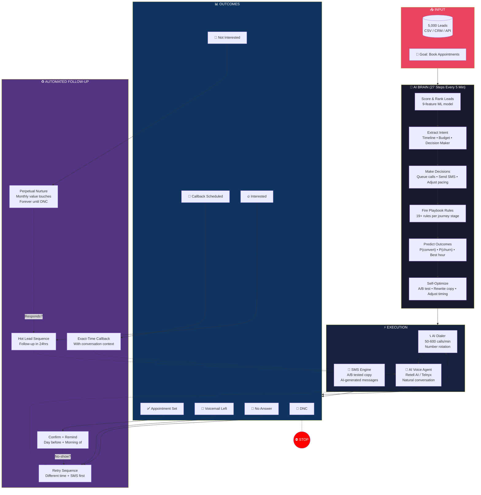
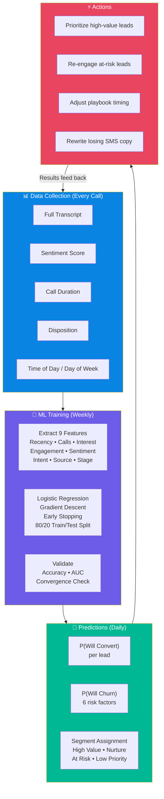
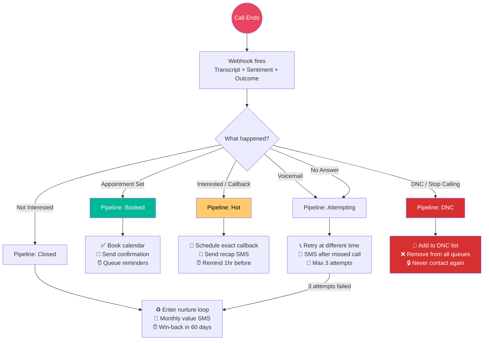
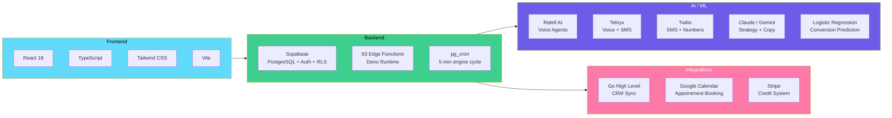

# Dial Smart System — Architecture

## The Autonomous Loop

Every 5 minutes, the AI engine runs this complete cycle:

## Workflow Branching — How Every Lead Takes a Different Path

```mermaid
flowchart LR
    START(("New Lead")) --> CALL1["📞 Call #1\n5 min after import"]

    CALL1 --> ANSWERED{Answered?}

    ANSWERED -->|YES| INTEREST{Interest > 7?}
    INTEREST -->|YES| BOOK["📅 Book Appointment"]
    INTEREST -->|NO| FOLLOWUP_CALL["📞 Follow-up\nin 24hrs"]

    ANSWERED -->|NO| SMS1["💬 SMS\nHey, just tried calling..."]
    SMS1 --> WAIT1["⏳ Wait 4hrs"]
    WAIT1 --> CALL2["📞 Call #2"]

    CALL2 --> ANSWERED2{Answered?}
    ANSWERED2 -->|YES| INTEREST
    ANSWERED2 -->|NO| AI_SMS["🤖 AI SMS\nPersonalized re-engagement"]
    AI_SMS --> WAIT2["⏳ Wait 48hrs"]
    WAIT2 --> CALL3["📞 Call #3"]

    CALL3 --> ANSWERED3{Answered?}
    ANSWERED3 -->|YES| INTEREST
    ANSWERED3 -->|NO| NURTURE["♻️ Monthly Nurture\nValue-driven SMS\nLoop forever"]

    BOOK --> CONFIRM["✅ Confirmation SMS"]
    CONFIRM --> REMIND1["📱 Remind Day Before"]
    REMIND1 --> REMIND2["📱 Remind Morning Of"]

    FOLLOWUP_CALL --> ANSWERED
    NURTURE -->|"Lead responds"| INTEREST

    style START fill:#e94560,color:#fff
    style BOOK fill:#00b894,color:#fff
    style NURTURE fill:#6c5ce7,color:#fff
```

## The ML Learning Loop

## Disposition Flow — What Happens After Every Call

## Tech Stack

